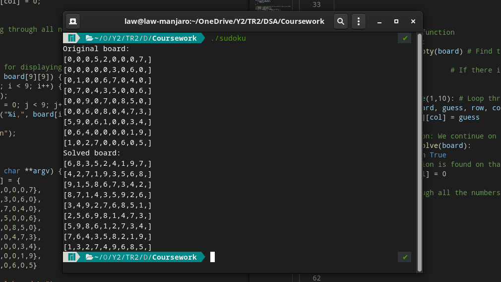

# sudoku-c
9x9 Sudoku solver using recursion and backtracking (bruteforce) in C

## **Disclaimer**
### All credit goes to [kying18's YouTube video](https://www.youtube.com/watch?v=tvP_FZ-D9Ng).     
This is simply a rewrite of her approach and Python code into C  

---

## Changes
1. As C does not have a ```boolean``` type, ```int``` was used instead.
2. Likewise, ```None``` was replaced with ```-1```

---

## Build
### GCC (Linux)
Build  
```gcc -o sudoku sudoku.c```    

Run  
```./sudoku```  
### Other compilers
You're on your own.

---


